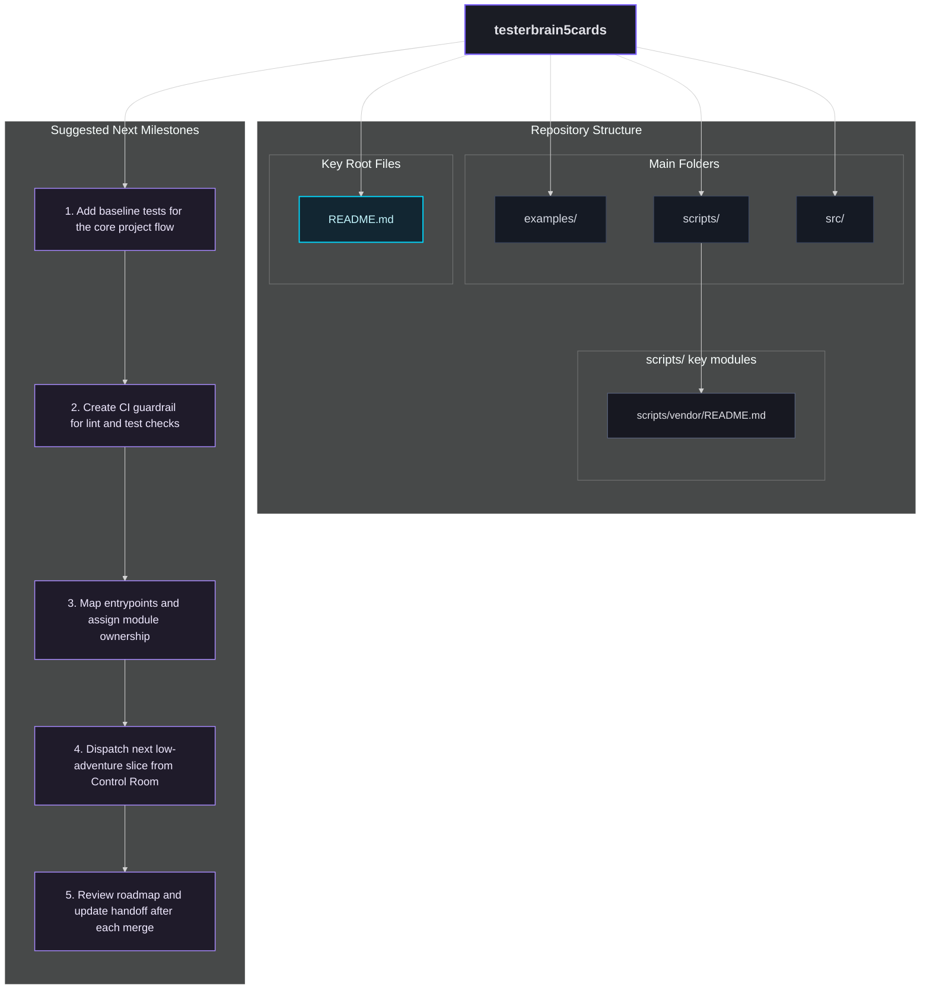

# ROADMAP

Generated: 2026-04-21T09:52:58Z
Scan Settings: depth=4, max_dirs=7, max_files_per_dir=2, max_total_modules=14

## Repo Structure Summary
- Top folders: examples, scripts, src
- Highlighted key modules: 1
- Key root files: README.md

## Actionable Module Highlights
- scripts/: scripts/vendor/README.md

## Suggested Milestones
1. Add baseline tests for the core project flow
2. Create CI guardrail for lint and test checks
3. Map entrypoints and assign module ownership
4. Dispatch next low-adventure slice from Control Room
5. Review roadmap and update handoff after each merge

## Mermaid

## Roadmap Node Actions
- D1 | folder | examples
- D2 | folder | scripts
- D3 | folder | src
- M1 | milestone | Add baseline tests for the core project flow
- M2 | milestone | Create CI guardrail for lint and test checks
- M3 | milestone | Map entrypoints and assign module ownership
- M4 | milestone | Dispatch next low-adventure slice from Control Room
- M5 | milestone | Review roadmap and update handoff after each merge
