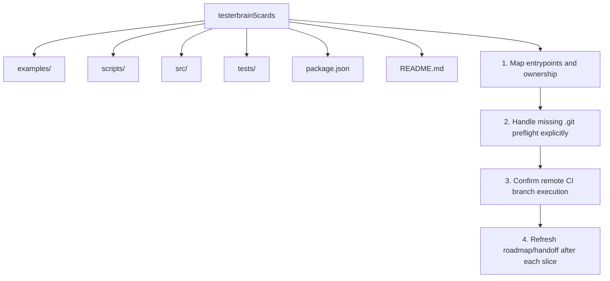

# ROADMAP

Generated: 2026-04-22T09:39:00Z
Truth posture: Repository reality validated locally on 2026-04-22.

## Repo Structure Summary
- Top folders: `examples`, `scripts`, `src`, `tests`, `G-Codex-brain`
- Key root files: `package.json`, `README.md`, `index.html`, `eslint.config.js`
- Runtime profile: browser game UI in `src/game.js` with deterministic core logic in `src/game-core.js`
- Verification profile: `npm run check` (lint + test) passes locally
- VCS reality: `.git` is absent in repo root, so branch/status/commit flows are currently unavailable

## Canonical Workflows (Shipped)
1. Run game locally by opening `index.html` in a browser.
2. Run deterministic checks:
   - `npm run check`
3. Run Control Room and watcher when needed:
   - `./scripts/conductor.sh dashboard`
   - `./scripts/conductor.sh watch start`

## Suggested Milestones
1. Map entrypoints and assign module ownership notes for `src/`, `tests/`, and `scripts/`.
2. Add explicit handling guidance for missing `.git` metadata during handoff preflight.
3. Confirm remote CI execution on the intended default branch once git metadata is restored.
4. Review roadmap and update handoff after each meaningful slice.

## Mermaid

## Roadmap Node Actions
- D1 | folder | examples
- D2 | folder | scripts
- D3 | folder | src
- D4 | folder | tests
- M1 | milestone | Map entrypoints and assign module ownership
- M2 | milestone | Add missing .git preflight handling guidance
- M3 | milestone | Confirm remote CI branch execution
- M4 | milestone | Review roadmap and update handoff after each meaningful slice
